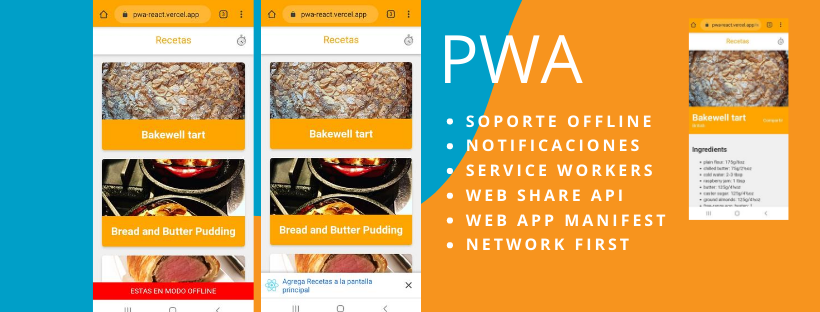

# Platzi Recetas - PWA con React

PWA que utiliza la API de MealDB para mostrar recetas con sus instrucciones. Algunas de las features que tiene son:

* Soporte Offline con Workbox
* Estrategias de Red apropiadas para cada recurso
* Add to Home Screen
* Web Share API
* Creado con [Create React App](https://create-react-app.dev/)

[Ver La APP](https://pwa-react.vercel.app/)

## Scripts 
* `npm install` para instalar las dependencias
* `npm run dev` para entorno de desarrollo
* `npm run build && npm start` para producción

## Licencia

MIT